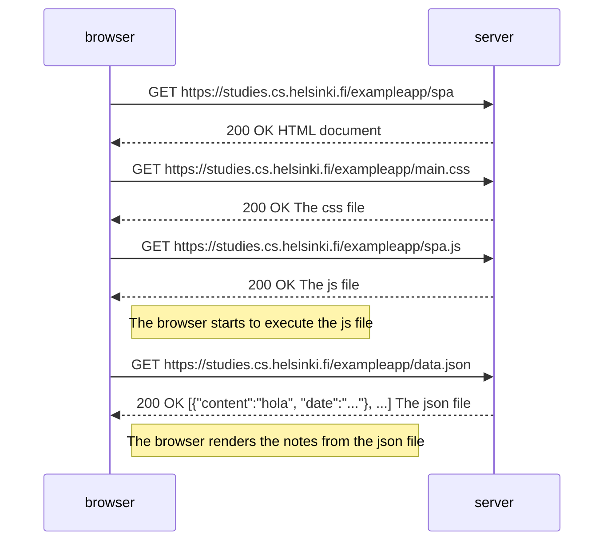

```mermaid
sequenceDiagram
    participant browser
    participant server

    browser->>server: GET https://studies.cs.helsinki.fi/exampleapp/spa
    server-->>browser: 200 OK HTML document

    browser->>server: GET https://studies.cs.helsinki.fi/exampleapp/main.css
    server-->>browser: 200 OK The css file

    browser->>server: GET https://studies.cs.helsinki.fi/exampleapp/spa.js
    server-->>browser:200 OK The js file

    Note right of browser: The browser starts to execute the js file

    browser->>server: GET https://studies.cs.helsinki.fi/exampleapp/data.json
    server-->>browser: 200 OK [{"content":"hola", "date":"..."}, ...] The json file

    Note right of browser: The browser renders the notes from the json file
```
