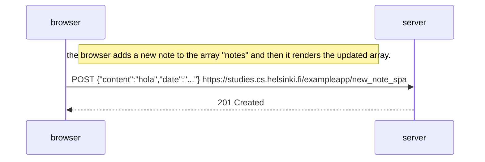

```mermaid
sequenceDiagram
    participant browser
    participant server

    Note right of browser: the browser adds a new note to the array "notes" and then it renders the updated array.

    browser->>server: POST {"content":"hola","date":"..."} https://studies.cs.helsinki.fi/exampleapp/new_note_spa
    server-->>browser: 201 Created
```
