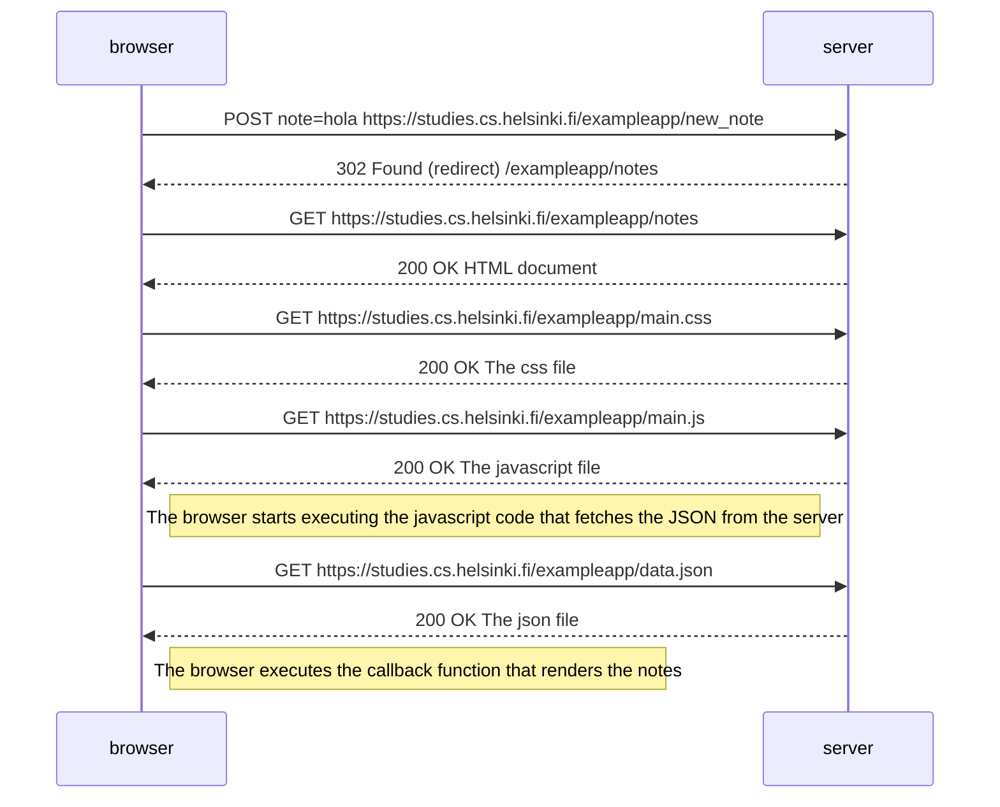

```mermaid
sequenceDiagram
    participant browser
    participant server

    browser->>server: POST note=hola https://studies.cs.helsinki.fi/exampleapp/new_note
    server-->>browser: 302 Found (redirect) /exampleapp/notes

    browser->>server: GET https://studies.cs.helsinki.fi/exampleapp/notes
    server-->>browser: 200 OK HTML document

    browser->>server: GET https://studies.cs.helsinki.fi/exampleapp/main.css
    server-->>browser: 200 OK The css file

    browser->>server: GET https://studies.cs.helsinki.fi/exampleapp/main.js
    server-->>browser: 200 OK The javascript file

    Note right of browser: The browser starts executing the javascript code that fetches the JSON from the server

    browser->>server: GET https://studies.cs.helsinki.fi/exampleapp/data.json   
    server-->>browser: 200 OK The json file

    Note right of browser: The browser executes the callback function that renders the notes
```
